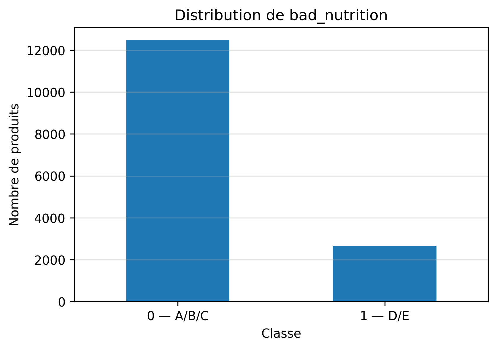

# DATASET.md — Healthy Illusion

## a) Identification

**Nom du dataset :** Healthy Illusion Dataset  
**Projet :** Détection des produits alimentaires à image saine mais mauvaise qualité nutritionnelle  
**Auteurs :** HAJJOU Hajar, ERRABOUN Nouha, BENKRIMEN Wiam  
**Date de collecte :** 15/05/2026  
**Version :** v3.0  

---

## b) Source

Les données ont été collectées à partir de l’API publique **Open Food Facts**.

**API utilisée :** Open Food Facts API  
**URL principale :** `https://world.openfoodfacts.org`  
**Endpoint interrogé :**

```text
GET https://world.openfoodfacts.org/cgi/search.pl
```

La collecte est réalisée par catégories Open Food Facts. Exemples de catégories utilisées :

```text
waters, milk, plain-yogurts, plant-based-beverages, wholemeal-breads,
breakfast-cereals, muesli, granola, yogurts, fruit-juices, smoothies,
protein-bars, energy-bars, biscuits, chocolates
```

Paramètres principaux utilisés dans les appels API :

```text
action=process
json=1
page_size=200
page={page}
fields=code,product_name,brands,categories_tags,labels_tags,
       countries_tags,nutriscore_grade,nutrition_grades,
       nutriments,additives_n,additives_tags
sort_by=unique_scans_n
tagtype_0=categories
tag_contains_0=contains
tag_0={categorie}
```

**Date d’accès :** 15/05/2026  

Les réponses brutes de l’API sont sauvegardées dans :

```text
data/raw/*.json
```

Le dataset final est sauvegardé dans :

```text
data/dataset.csv
```

Un échantillon de 100 lignes est sauvegardé dans :

```text
data/sample.csv
```

---

## c) Description

### Objectif du dataset

L’objectif de ce dataset est de préparer des données exploitables pour un problème de classification supervisée autour de la qualité nutritionnelle des produits alimentaires.

Le problème métier étudié est le suivant :

> Peut-on identifier les produits alimentaires qui peuvent avoir une image saine, mais qui présentent en réalité une mauvaise qualité nutritionnelle ?

Dans ce projet, le modèle ne prédit pas directement une notion subjective d’« illusion saine ».  
La variable cible principale est `bad_nutrition`.

Ensuite, la variable métier `healthy_illusion` permet d’identifier les produits qui ont à la fois :

```text
image_saine = 1
bad_nutrition = 1
```

Cela correspond aux produits qui possèdent une image saine, mais qui ont une mauvaise qualité nutritionnelle selon le Nutri-Score.

---

### Dimensions du dataset

**Nombre de lignes :** 15 114  
**Nombre de colonnes :** 18  

---

### Schéma détaillé des variables

| Variable | Type | Description métier | Plage de valeurs / Modalités | Unité |
|---|---|---|---|---|
| `code` | Catégorielle | Identifiant unique du produit dans Open Food Facts | Code produit | Aucune |
| `product_name` | Catégorielle | Nom du produit | Texte | Aucune |
| `brands` | Catégorielle | Marque du produit | Texte | Aucune |
| `main_category` | Catégorielle | Catégorie principale du produit | Exemples : yogurts, muesli, biscuits, chocolates | Aucune |
| `country` | Catégorielle | Pays associé au produit | Exemples : france, morocco, united-states | Aucune |
| `sugars_100g` | Numérique | Quantité de sucres pour 100g | Valeur positive ou nulle | g / 100g |
| `fat_100g` | Numérique | Quantité de graisses pour 100g | Valeur positive ou nulle | g / 100g |
| `saturated_fat_100g` | Numérique | Quantité de graisses saturées pour 100g | Valeur positive ou nulle | g / 100g |
| `salt_100g` | Numérique | Quantité de sel pour 100g | Valeur positive ou nulle | g / 100g |
| `fiber_100g` | Numérique | Quantité de fibres pour 100g | Valeur positive ou nulle | g / 100g |
| `proteins_100g` | Numérique | Quantité de protéines pour 100g | Valeur positive ou nulle | g / 100g |
| `energy_kcal_100g` | Numérique | Énergie du produit pour 100g | Valeur positive ou nulle | kcal / 100g |
| `additives_count` | Numérique | Nombre d’additifs détectés | 0, 1, 2, ... | Nombre |
| `has_labels` | Binaire | Indique si le produit possède au moins un label | 0 = non, 1 = oui | Aucune |
| `image_saine` | Binaire | Indique si le produit possède une catégorie ou un label donnant une image nutritionnelle positive | 0 = non, 1 = oui | Aucune |
| `nutriscore_grade` | Catégorielle | Nutri-Score fourni par l’API | a, b, c, d, e | Aucune |
| `bad_nutrition` | Binaire | Variable cible indiquant une mauvaise qualité nutritionnelle | 0 = A/B/C, 1 = D/E | Aucune |
| `healthy_illusion` | Binaire | Variable métier indiquant un produit à image saine mais mauvaise qualité nutritionnelle | 0 = non, 1 = oui | Aucune |

---

### Variable cible

La variable cible du projet est :

```text
bad_nutrition
```

Elle est construite à partir de `nutriscore_grade`.

Règle utilisée :

```text
Nutri-Score A, B ou C → bad_nutrition = 0
Nutri-Score D ou E   → bad_nutrition = 1
```

Interprétation :

| Valeur | Signification |
|---|---|
| `0` | Produit avec qualité nutritionnelle acceptable |
| `1` | Produit avec mauvaise qualité nutritionnelle |

---

### Remarque méthodologique sur le Nutri-Score

La colonne `nutriscore_grade` provient directement de l’API Open Food Facts. Elle est utilisée uniquement pour construire la variable cible `bad_nutrition`.

Nous conservons `nutriscore_grade` dans le dataset afin de garder une trace claire de la construction de la cible et de faciliter la vérification du dataset.

Cependant, cette colonne ne sera pas utilisée comme variable d’entrée lors de l’entraînement des modèles. En effet, comme elle sert directement à construire la cible, l’utiliser comme feature donnerait indirectement la réponse au modèle et fausserait l’évaluation.

Ainsi, lors de la phase d’entraînement, les variables utilisées seront uniquement les caractéristiques descriptives du produit : valeurs nutritionnelles, nombre d’additifs, catégorie principale, pays, labels et variable `image_saine`.

---

### Distribution des classes

La distribution de la variable cible `bad_nutrition` est la suivante :

| Classe | Signification | Nombre de produits | Pourcentage |
|---|---|---:|---:|
| `0` | Qualité nutritionnelle acceptable | 12 467 | 82.49 % |
| `1` | Mauvaise qualité nutritionnelle | 2 647 | 17.51 % |

La classe minoritaire est donc :

```text
bad_nutrition = 1
```

Elle représente :

```text
17.51 %
```

Cette distribution respecte la condition de déséquilibre, car la classe minoritaire est comprise entre 5 % et 25 %.

---

### Graphique de distribution

Le graphique suivant présente la distribution de la variable cible `bad_nutrition`.



---

### Remarque sur les labels

Les labels Open Food Facts peuvent contenir plusieurs types d’informations : labels nutritionnels, labels de qualité, labels d’origine, labels environnementaux ou informations de certification.

Pour construire `image_saine`, nous utilisons uniquement les labels liés à une image nutritionnelle positive, comme :

```text
bio, organic, no-added-sugar, low-fat, reduced-fat,
high-protein, source-of-fibre, rich-in-fibre, natural
```

Les labels d’origine ou de fabrication, comme `made-in-spain` ou plus généralement `made-in-*`, ne sont pas considérés comme des labels santé et ne sont donc pas utilisés pour définir `image_saine`.

---
